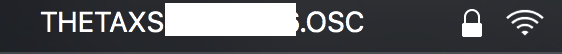

# RICOH THETA S を Wifi でつなぎ、 Mac OS X の Terminal から写真を撮って360度のビューで画像を確認する方法

文章の目的は API の簡単な使用法を説明すること。

流れは以下のようになっている。
1. THETA S との wifi に接続する。
2. THETA S との 接続を確認する。
3. THETA S とセッション(写真を撮影したりするのに必要)を開始する。
4. THETA S とのセッションの状態を確認する。
4. THETA S で画像を撮影する。
5. THETA S の写真を転送する。（オプション）
6. THETA S の写真を表示する。（オプション）
7. 4 ~ 6 を好きなだけ繰り返す。（オプション）
5. THETA S とセッションを終了する。

## 1. 準備

### Wifi を接続する。



に接続する。

本体のIPアドレスは192.168.1.1でポートは80である。

## 2. 情報を取得

接続できていることを確認する。

 ` $ curl http://192.168.1.1:80/osc/info`

と叩いて、次のようなことが帰って来れば接続中。

```
{
  "manufacturer": "RICOH",
  "model": "RICOH THETA S",
  "serialNumber": "00203876",
  "firmwareVersion": "01.11",
  "supportUrl": "https://theta360.com/en/support/",
  "endpoints": {
    "httpPort": 80,
    "httpUpdatesPort": 80
  },
  "gps": false,
  "gyro": false,
  "uptime": 188,
  "api": [
    "/osc/info",
    "/osc/state",
    "/osc/checkForUpdates",
    "/osc/commands/execute",
    "/osc/commands/status"
  ]
}
```


## 3. セッション開始
`$ curl -X POST http://192.168.1.1:80/osc/commands/execute -d '{"name": "camera.startSession"}`

これに対する応答が次のようになってれば良い。
```
{
  "name": "camera.startSession",
  "state": "done",
  "results": {
    "sessionId": "SID_0001",
    "timeout": 180
  }
}
```
ここで `sessionId` は開始したセッションの一意な呼び名となっている。
セッションを開始していない時の `sessionId` は `SID_0000` である。

セッションが開始していないと、写真撮影(`camera.takePicture`)ができない。
ただし、写真転送(`camera.getImage`)はできる。

## 4. 現在のセッション等の状態確認
`$ curl -X POST http://192.168.1.1:80/osc/state`

この時、`sessionId` が `SID_0001` なら
```
{
  "fingerprint": "FIG_0010",
  "state": {
    "sessionId": "SID_0001",
    "batteryLevel": 0.67,
    "storageChanged": false,
    "_captureStatus": "idle",
    "_recordedTime": 0,
    "_recordableTime": 0,
    "_latestFileUri": "100RICOH/R0010745.JPG",
    "_batteryState": "charging"
  }
}
```
などと出る。


最新のファイル名が `"_latestFileUri": "100RICOH/R0010745.JPG"` で表示される。

## 5. 写真撮影

上記状態確認などで、セッションが開始されたことを確認してから、

`$ curl -X POST http://192.168.1.1:80/osc/commands/execute -d '{"name": "camera.takePicture", "parameters": {"sessionId": "SID_0001"}}'`

と叩く。ここで最後の `sessionId` のあたいには、先ほど開始したセッションの ID を書く（例えば、 `SID_0002` など)。うまくいけば、次のように表示される。

```
{
  "name": "camera.takePicture",
  "state": "inProgress",
  "id": "4",
  "progress": {
    "completion": 0
  }
}
```

ここでもし、セッションを開始していなかったり、`sessionId` を間違えている場合には次のように表示される。
```
{
  "name": "camera.takePicture",
  "state": "error",
  "error": {
    "code": "invalidSessionId",
    "message": "The sessionId is invalid."
  }
}
```

## 6. 写真転送

撮影した写真は次のように THETA S 本体から PC に転送することができる。

`$ curl -X POST http://192.168.1.1:80/osc/commands/execute -d '{"name": "camera.getImage", "parameters": {"fileUri": "100RICOH/R0010749.JPG"}}' > picture.jpg`

として、
```
% Total    % Received % Xferd  Average Speed   Time    Time     Time  Current
                               Dload  Upload   Total   Spent    Left  Speed
100 3893k  100 3893k  100    79  1003k     20  0:00:03  0:00:03 --:--:-- 1003k
```
という画面が表示されれば成功。
今の場合、作業しているディレクトリの中に、 `picture.jpg` という名前で保存されている。

## 7. 写真の確認。

パノラマビュー(長方形に収めた写真）で確認するだけなら、
```
$ open picture.jpg
```
とすれば良い。

360度画像として確認したい場合には、RICOH THETA の公式アプリ RICOH THETA をインストールした上で、
```
$ open -a "RICOH THETA" picture.jpg
```
と叩けば良い。

## 8. セッション終了

`$ curl -X POST http://192.168.1.1:80/osc/commands/execute -d '{"name": "camera.closeSession", "parameters": {"sessionId": "SID_0001"}}'`

とすれば、/
```
{
  "name": "camera.closeSession",
  "state": "done"
}
```
となり、セッションが終了する。

写真転送と写真の確認は、セッションが終了している状態でも実行できる。


## 補遺 RICOH THETA アプリのインストール

https://theta360.com/ja/support/download/

にアクセスし、「パソコン用アプリケーション」の「基本アプリ」のダウンロードをして、流れに従うだけ。ダウンロードが完了したら、Terminal 上で、
```
$ open -a "RICOH THETA" picture.jpg
```
とするか、あるいはアプリを直接開けば良い。
